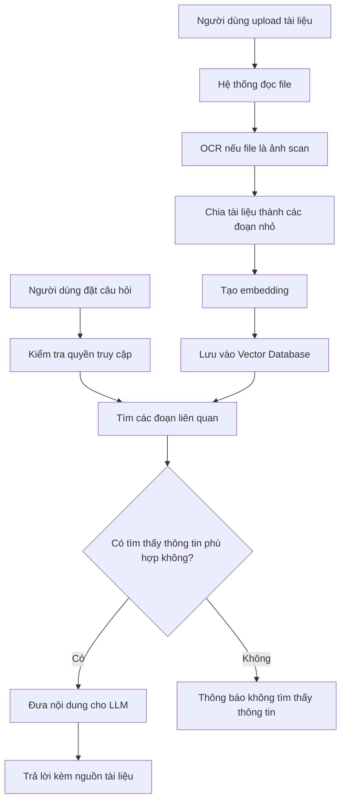

# Workflow RAG

## Luồng hoạt động

1. Người dùng upload tài liệu.
2. Hệ thống đọc, xử lý và chia nhỏ nội dung.
3. Các đoạn nội dung được lưu vào vector database.
4. Người dùng đặt câu hỏi.
5. Hệ thống kiểm tra quyền của người dùng.
6. Hệ thống tìm các đoạn tài liệu liên quan.
7. Nếu tìm được, LLM tạo câu trả lời kèm nguồn.
8. Nếu không tìm được, hệ thống yêu cầu người dùng hỏi rõ hơn hoặc báo không có thông tin.
